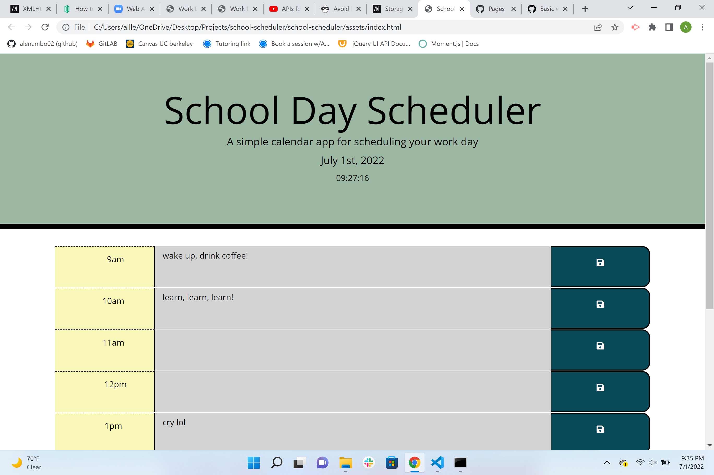

# School Scheduler Starter Code

## Description
Hello, 
Here you will find a school scheduler I have created that allows the user to input their hourly activities per day. The neat part about this scheduler is that depending on the time the planner will color code the time for you. What I mean by that is that the current time will be displayed by the color red. The time before your current time will be shown to you by displaying a grey color and finally the present time will be displayed to you in green. Which is kinda cool so that you dont have to worry about checking the time, and also the time/date is displayed for you at the top of the webpage.

Ideas: It would pretty awesome if I could figure out how to create daily habit trackers. Also, when you are falling behind on those habits you can be alerted with popup displays that remind you to for example drink water, read or take a small break.

Challenges: I defiently struggled with trying to figure out how to get my text to display after refreshing the browser. I first found the init method, I tried to apply it and failed. Then I tried to store the items by only using getitem, which was another fail. Finally, after a lengthy time passed I realized I was just plugging in my variable incorrectly. 

## Usage
You may use this page to access information about local storage, how to utilize different API's within your html, and to debug. 
Feel free to reach out to me with ways I can simplify my code or better it!
I have included an image reference to the page and a deployed link of the webpage below:
------> https://alenambo02.github.io/school-scheduler/ <------




Also I included a code snippet of how to use moment.js to access the current day below:
```
var today = moment();
$("#currentDay").text(today.format("MMMM Do, YYYY"));
```
## License 
MIT License

Copyright (c) 2022 Ale

Permission is hereby granted, free of charge, to any person obtaining a copy
of this software and associated documentation files (the "Software"), to deal
in the Software without restriction, including without limitation the rights
to use, copy, modify, merge, publish, distribute, sublicense, and/or sell
copies of the Software, and to permit persons to whom the Software is
furnished to do so, subject to the following conditions:

The above copyright notice and this permission notice shall be included in all
copies or substantial portions of the Software.

THE SOFTWARE IS PROVIDED "AS IS", WITHOUT WARRANTY OF ANY KIND, EXPRESS OR
IMPLIED, INCLUDING BUT NOT LIMITED TO THE WARRANTIES OF MERCHANTABILITY,
FITNESS FOR A PARTICULAR PURPOSE AND NONINFRINGEMENT. IN NO EVENT SHALL THE
AUTHORS OR COPYRIGHT HOLDERS BE LIABLE FOR ANY CLAIM, DAMAGES OR OTHER
LIABILITY, WHETHER IN AN ACTION OF CONTRACT, TORT OR OTHERWISE, ARISING FROM,
OUT OF OR IN CONNECTION WITH THE SOFTWARE OR THE USE OR OTHER DEALINGS IN THE
SOFTWARE.

## Credits 
Helpful tool to understand local storage:
https://egghead.io/lessons/javascript-avoid-losing-text-when-refreshing-the-browser-with-localstorage
Also, I would like to credit the material learned in class under local storage. Turns out the method worked I was just applying it incorrectly.
